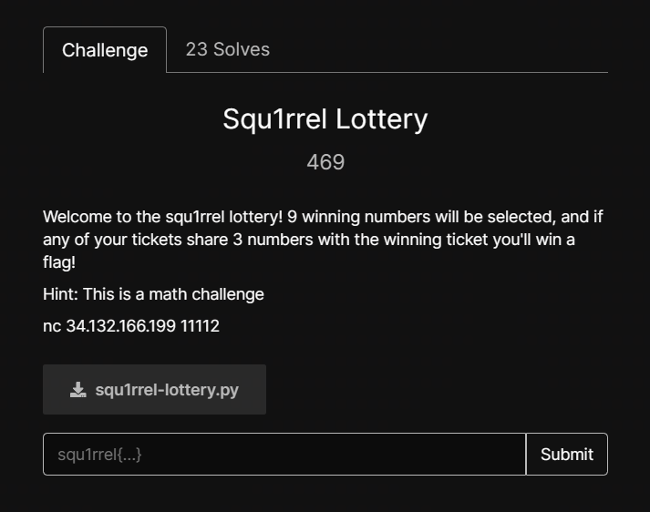

# SQU1RREL CTF 2024
Write-up for SQU1RREL CTF 2024
<!--more-->
## Lazy RSA



```lazyrsa.txt=
n: 23690620655271165329693230765997410033604713853187305472268813793031152348107488119317901392104240429826482611449247251262846508667797483465355228800439339041030982259847598574606272955688345490638311164838117491821117626835340577511562130640807587611523935604871183668968359720411023759980144229161581597397061850707647104033348795132205561234674677139395868595692235525931999596382758921793937149945229459379437008216713404350896206374483356969246476531491049930769999387038678280465689487577291475554699094024761030833540509263174840007922218340417888061099317752496279552046029470370474619439450870110783844218281
e: 65537
ct: 11420169733597912638453974310976296342840438772934899653944946284527921765463891354182152294616337665313108085636067061251485792996493148094827999964385583364992542843630846911864602981658349693548380259629884212903554470004231160866680745154066318419977485221228944716844036265911222656710479650139274719426252576406561307088938784324291655853920727176132853663822020880574204790442647169649094846806057218165102873847070323190392619997632103724159815363319643022552432448214770378596825200154298562513279104608157870845848578603703757405758227316242247843290673221718467366000253484278487854736033323783510299081405
```
N factor được nên ta dễ dàng có được FLAG.

> Flag: squ1rrel{laziness_will_be_the_answer_eventually}

## RSA RSA RSA




```
e: 3
n1: 96137714481560340073780038250015316564930752333880363375193088083653975552334517899735106334409092229494004991796910602440032630762575914714152238916128674595912438177270978040111855327624812652948702562503276973409716595778936978757384935820012322432156169815110042972411989274515686945691887468406312791931
ct1: 45640508926729498938915879450220374487095109122207451961200230820161694723491945276893630019713859109920025191680053056485030809079137883906737197875968862878423820820515399840094772412319820062860149582361429346029277273870654355752499436360499181221418835401103925420623212341317366954144592892392013649421
n2: 90990790933807553440094447797505116528289571569256574363585309090304380702927241663491819956599368816997683603352289726407304960362149545383683196526764288524742203975596414405902155486632888712453606841629050125783639571606440840246928825545860143096340538904060826483178577619093666337611264852255012241011
ct2: 58149644956871439128498229750735120049939213159976216414725780828349070974351356297226894029560865402164610877553706310307735037479690463594397903663323983980128060190648604447657636452565715178438939334318494616246072096228912870579093620604596752844583453865894005036516299903524382604570097012992290786402
n3: 86223965871064436340735834556059627182534224217231808576284808010466364412704836149817574186647031512768701943310184993378236691990480428328117673064942878770269493388776005967773324771885109757090215809598845563135795831857972778498394289917587876390109949975194987996902591291672194435711308385660176310561
ct3: 16168828246411344105159374934034075195568461748685081608380235707338908077276221477034184557590734407998991183114724523494790646697027318500705309235429037934125253625837179003478944984233647083364969403257234704649027075136139224424896295334075272153594459752240304700899700185954651799042218888117178057955
```
Với bài này ta nghĩ đến ngay `CRT`. <br>
**Solution:**
```python
from Crypto.Util.number import long_to_bytes
e = 3
n1 = 96137714481560340073780038250015316564930752333880363375193088083653975552334517899735106334409092229494004991796910602440032630762575914714152238916128674595912438177270978040111855327624812652948702562503276973409716595778936978757384935820012322432156169815110042972411989274515686945691887468406312791931
ct1 = 45640508926729498938915879450220374487095109122207451961200230820161694723491945276893630019713859109920025191680053056485030809079137883906737197875968862878423820820515399840094772412319820062860149582361429346029277273870654355752499436360499181221418835401103925420623212341317366954144592892392013649421
n2 = 90990790933807553440094447797505116528289571569256574363585309090304380702927241663491819956599368816997683603352289726407304960362149545383683196526764288524742203975596414405902155486632888712453606841629050125783639571606440840246928825545860143096340538904060826483178577619093666337611264852255012241011
ct2 = 58149644956871439128498229750735120049939213159976216414725780828349070974351356297226894029560865402164610877553706310307735037479690463594397903663323983980128060190648604447657636452565715178438939334318494616246072096228912870579093620604596752844583453865894005036516299903524382604570097012992290786402
n3 = 86223965871064436340735834556059627182534224217231808576284808010466364412704836149817574186647031512768701943310184993378236691990480428328117673064942878770269493388776005967773324771885109757090215809598845563135795831857972778498394289917587876390109949975194987996902591291672194435711308385660176310561
ct3 = 16168828246411344105159374934034075195568461748685081608380235707338908077276221477034184557590734407998991183114724523494790646697027318500705309235429037934125253625837179003478944984233647083364969403257234704649027075136139224424896295334075272153594459752240304700899700185954651799042218888117178057955
N = [n1, n2, n3]
C = [ct1, ct2, ct3]
m = pow(crt(C, N), 1/3)
long_to_bytes(int(m))
```

> flag: squ1rrel{math_is_too_powerful_1q3y41t1s98u23rf8}

# Partial RSA



```
n: 103805634552377307340975059685101156977551733461056876355507089800229924640064014138267791875318149345634740763575673979991819014964446415505372251293888861031929442007781059010889724977253624216086442025183181157463661838779892334251775663309103173737456991687046799675461756638965663330282714035731741912263
e: 3
ct: 24734873977910637709237800614545622279880260333085506891667302143041484966318230317192234785987158021463825782079898979505470029030138730760671563038827274105816021371073990041986605112686349050253522070137824687322227491501626342218176173909258627357031402590581822729585520702978374712113860530427142416062
```

* :bulb:Khi đọc hint của đề, mình biết là phải sử dụng `form flag` để giải bài này.

* Flag sẽ có dạng: `squ1rrel{?}`. Như vậy ta đã biết được 9 bytes đầu của Flag và ta cần tìm các bytes còn lại.
* Gọi $x$ là đoạn phần flag cần tìm, $a$ là form flag. 
* Ta có:
$$m = bytes\_{to}\_{long(a)}*256^{len(x)} + bytes\_{to}\_{long(x)}$$
* Ta có phương trình như sau:
$$m^3 - ct= 0 \pmod n$$
Ta sẽ giải phương trình này bằng `small_root`. Nhưng vì không biết độ dài của flag nên ta sẽ `brute-force` độ dài của nó.<br>
**Sage:**
```Python
from Crypto.Util.number import bytes_to_long, long_to_bytes
n = 103805634552377307340975059685101156977551733461056876355507089800229924640064014138267791875318149345634740763575673979991819014964446415505372251293888861031929442007781059010889724977253624216086442025183181157463661838779892334251775663309103173737456991687046799675461756638965663330282714035731741912263
e = 3
c = 24734873977910637709237800614545622279880260333085506891667302143041484966318230317192234785987158021463825782079898979505470029030138730760671563038827274105816021371073990041986605112686349050253522070137824687322227491501626342218176173909258627357031402590581822729585520702978374712113860530427142416062

a = bytes_to_long(b'squ1rrel{')
P.<x> = PolynomialRing(Zmod(n))
for i in range(30, 50):
    f = ((a*256**i + x)**3 - c)
    tmp = f.small_roots(X = 256**i , beta = i/(len('squ1rrel{') + i))
    if len(tmp) !=0 :
        print(b'squ1rrel{' + long_to_bytes(int(tmp[0])))
        break
```
>flag: squ1rrel{wow_i_was_betrayed_by_my_own_friend}

## squ1rrel treasury



- `nc treasury.squ1rrel-ctf-codelab.kctf.cloud 1337`

[chall.py](https://squ1rrel-ctf-uploads.storage.googleapis.com/uploads/1f32e9b81e3d43fc0bca8f9b9104ec2cc0173ec1eb441924e2a7b1ab9435bfed/chall.py)

Đọc kỹ source code ta nhận ra cách mã hóa `Key` của nó chính là CBC, thế mà ông author cứ thích viết dài dòng thôiii 🤡. Và ta sẽ sử dụng Flip CBC để lấy được FLAG.
```python
def getKey(self):
        save = f"{self.__name}:{self.__balance}".encode()
        blocks = blockify(save, AES.block_size)
        pblocks = pad(blocks, b'\x00', AES.block_size)
        cipher = AES.new(KEY, AES.MODE_ECB)
        ct = []
        for i, b in enumerate(pblocks):
            if i == 0:
                tmp = strxor(b, self.__iv)
                ct.append(cipher.encrypt(tmp))
            else:
                tmp = strxor(strxor(ct[i-1], pblocks[i-1]), b)
                ct.append(cipher.encrypt(tmp))
        ct_str = f"{self.__iv.hex()}:{(b''.join(ct)).hex()}"
        return ct_str

    def load(key: str):
        key_split = key.split(':')
        iv = bytes.fromhex(key_split[0])
        ct = bytes.fromhex(key_split[1])
        cipher = AES.new(KEY, AES.MODE_ECB)
        pt = blockify(cipher.decrypt(ct), AES.block_size)
        ct = blockify(ct, AES.block_size)
        for i, p in enumerate(pt):
            if i == 0:
                pt[i] = strxor(p, iv)
            else:
                pt[i] = strxor(strxor(ct[i-1], pt[i-1]), p)
        pt = b''.join(pt)
        pt_split = pt.split(b':')
        try:
            name = pt_split[0].decode()
        except Exception:
            name = "ERROR"
        balance = int(pt_split[1].strip(b'\x00').decode())
        return Account(iv, name, balance)
```
* Ban đầu `balance = 0` và nó sẽ được gộp với `name` để mã hóa và trả về cho ta `ciphertext`, `iv`.
* Ví dụ tên ta gửi vào là: `name = "quanda"`, thì sẽ trả về `encrypt_CBC("quanda:0")`.
* Ta có `max(FLAG_COST) = 10**14-1` nên target của ta là `balance = max(FLAG_COST)`.

**FLip CBC**
* Cách hoạt động của CBC:

* Màu xanh của iv cho thấy Plaintext thay đổi với bytes tương ứng với iv. Còn màu đỏ của ciphertext của block thứ 2 nó có ảnh hưởng làm thay đổi toàn bộ plaintext.
* Ta có: <br>
$P_1 = Dec_k(C1) \bigoplus IV$ <br>
* Set: $target = Dec_k(C1) \bigoplus IV'$
$\to IV' = IV \bigoplus P_1 \bigoplus target$

* Mình sẽ chọn `name = "a"*14` khi đó ta sẽ có một block là: `p = "aaaaaaaaaaaaaa:0"`
* Target mình chọn là `t = "a:99999999999999"`.
* Vì không sử dụng quá nhiều payload nên mình sẽ nhập trực tiếp đến server luôn nên sẽ không có script nào cả 🤣.
* Đây là đoạn tính toán `new_iv`.
```python
iv = bytes.fromhex('4a048459ad3ebc3b68c4c61d091a4b9b')
target = b'a:'+b'9'*14
c = bytes.fromhex("4ccffa2f796ce4381f37ba63a74d8a99")
new_iv = xor(xor(target, b'a'*14+b':0'), iv).hex()
print(new_iv)
```

>Flag: squ1rrel{7H3_4C0rN_3NCrYP710N_5CH3M3_15_14CK1N6}

## Squ1rrel Lottery


[squ1rrel-lottery.py](https://squ1rrel-ctf-uploads.storage.googleapis.com/uploads/e3d653cdb94418525b8d5848b1267d902fb1bbc76191aa26c7826f1ae8495cb0/squ1rrel-lottery.py)
* `nc 34.132.166.199 11112` 


```python
import random

# user version
def input_lines():
    lines = []
    print("Welcome to the squ1rrel lottery! 9 winning numbers will be selected, and if any of your tickets share 3 numbers with the winning ticket you'll win! Win 1000 times in a row to win a flag")
    for i in range(1, 41):
        while True:
            line = input(f"Ticket {i}: ").strip()
            numbers = line.split()
            if len(numbers) != 9:
                print("Please enter 9 numbers")
                continue
            try:
                numbers = [int(num) for num in numbers]
                if not all(1 <= num <= 60 for num in numbers):
                    print("Numbers must be between 1 and 60")
                    continue
                lines.append(set(numbers))
                break
            except ValueError:
                print("Please enter only integers.")
    return lines


user_tickets = input_lines()
wincount = 0
for j in range(1000):
    winning_ticket = random.sample(range(1, 61), 9)

    win = False
    for i in user_tickets:
        if len(i.intersection(set(winning_ticket))) >= 3:
            print(f'Win {j}!')
            win = True
            wincount += 1
            break
    if not win:
        print("99 percent of gamblers quit just before they hit it big")
        break

if wincount == 1000:
    print("squ1rrelctf{test_flag}")
```

Với challenge này ta sẽ gen ra 40 ticket. Nếu như có một trong 40 ticket đó có 3 số trong winning_ticket thì sẽ thắng. Và ta phải dùng 40 ticket đó để thắng 1000 thì ta sẽ FLAG.

Mỗi ticket bao gồm 9 số khác nhau từ 1 đến 60. 
